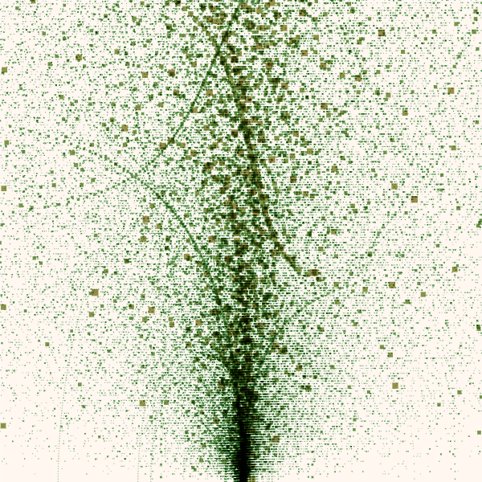

# Guide

This guide walks you through setting up and using amelia for you generative-art
projects.



## Sections

1. [What is amelia?](#what-is-amelia)
1. [Getting started](#getting-started)
   - [Using it as an ESM module](#using-it-as-an-esm-module)
   - [Using it in the web editor](#using-it-in-the-web-editor)
   - [The first sketch](#the-first-sketch)
     - [Creating an app](#creating-an-app)
     - [The model](#the-model)
     - [The view](#the-view)
     - [Drawing a rectangle](#drawing-a-rectangle)
1. [Drawing shapes](#drawing-shapes)
1. [Going more advanced]()
  - [The App and AppBuilder](#the-app-and-appbuilder)
  - [The Drawer](#the-drawer)
  - [Sizes](#sizes)
  - [Loop modes](#loop-modes)
1. [Technical information](#technical-infomation)

## What is amelia?

Amelia is an open-source creative-coding toolkit for modern JavaScript.

It is meant to be a simple and function collection of API's to rapidly create
good looking sketches. It puts an emphasis on the following aspects:

- **lightweight** - at the moment ~50kb in size
- **functional** - simple and easy to use function style API with a lot of
  functionality
- **fast** - tries to be as fast as possible by being a thin wrapper around the
  2D Canvas API

You can find the code on [GitHub](https://github.com/birdboat00/amelia). There
is also a gallery of examples that you can find [here](../examples/).

> Amelia is still very young and heavily work-in-progress so a lot of stuff might change.

## Getting started

Amelia is a collection of building blocks that help you create creative
generative art. Lets take a look on how to use it.

### Using it as an ESM module

First download amelia from the
[GitHub repository](https://github.com/birdboat00/amelia/) and copy the `module`
folder into your project.
You can also import amelia from jsDelivr, if you do that you don't need to
download it from GitHub.

Create a new script and include it into your HTML like this:
```html
<script type="module" src="path/to/your/script.mjs"></script>
```

It is important that you include it as a `type="module"` as amelia uses ESM
modules.

Now you can finally import amelia into your script like this:
```js
import { app } from "path/to/amelia/mod.mjs";
```

or if you get it from jsDelivr:
```js
import { app } from "https://cdn.jsdelivr.net/gh/birdboat00/amelia/module/mod.mjs";
```

### Using it in the web editor
> The web editor is still very work-in-progress and barely functional!

Go to [the editor site](../editor/index.html) and enter the code into the
text area on the right and click `run code`.

You have to import the module from `../module/mod.mjs` like this:
```js
import { app, Color } from "../module/mod.mjs";
```

### The first sketch

Amelia provides an `App` object that is the heart of your amelia sketch. It
provides a `Drawer` which is the _Pen_ of your sketch, provides the loop that
loops through our `view` function and does some other nice stuff.

#### Creating an app

Amelia some handy functionality to quickly create an `App`. This is done using
the `AppBuilder` class via the `app` function. You use it like this:

```js
app()
  .model(model)
  .view(view)
  .run();
```

This will create an empty canvas in your html and start running the app. If you
want your canvas added as a child to some HTML element you can pass its ID to
`.parent(id)`.

#### The model

The `model` function when calling `app()` allows you to specify a function that
will be called before the app loops for the first time and supply a state
(model) to the app that you can access in `view` function.

The model function looks like this:

```js
const model = (app) => {
  return {};
};
```

It is supplied the app instance so you can access it. For now we return a empty
model because we don't have any state yet.

You can imagine the `model` function as the place where you prepare your
pencils, pens and colours.

#### The view

The `view` function allows you to specify a function that will be called
everytime the app loops. This is where the drawing happens and it's the part of
the sketch where the most time is spent. It is supplied with the app instance
and the model that we supplied to the app in our `model` function.

The view function looks like this:

```js
const view = (app, model) => {
};
```

#### Drawing a rectangle

The app we created has a `Drawer`, imagine it like the pen of our app. It has
the ability to create a lot of primitives with properties like their position,
radius, width and height, color and so on.

Lets draw a a plum colored rectangle on an orange colored background.

First we have to aquire the `Drawer` instance of the app which is done by
calling `.draw()` on the app instance.

```js
const view = (app, model) => {
  let draw = app.draw();
};
```

We want some background so how do we do that? We call the `.background()`
function on the drawer! This gives us a `Background` that we can give a color to
with the `.color()` function.

```js
draw.background()
  .color(Color.Orange);
```

Colors are defined using the `Color` type which has some handy pre-defined
colors, in this case we use `Orange`!

Next we draw a rectangle. We can get a rectangle by calling `.rect()` on the
drawer. There are a lot of other primitives it can draw but more on that later
in the guide.

```js
draw.rect();
```

We also want to give it a position, size and a color.

```js
draw.rect()
    .xy(20, 20)
    .wh(60, 60)
    .color(Color.Plum);
```

With `xy(x, y)` we specify the position. The coordinates are in pixels. By
calling `wh(w, h)` we specify the width and height in pixels. We also want to
paint it in a nice color so we call `color(color)` with the color we want.

After all that we got to finish the frame and actually paint it on the canvas.
This is done by calling `Drawer.finish()` on the drawer.

```js
draw.finish();
```

This should give us the following image:

<div class="cc"><div class="example" id="gs-ex">
    <a class="sclink" href="./sketches/gettingstarted.mjs">Look at code</a>
</div></div>

## Drawing shapes
The `Drawer` can handle a lot of different primitives which
you can use to create beautiful art.

Here is a list:
- [Rectangles]()
- [Circles]()
- [Quads]()
- [Lines]()
- [Arcs]()
- [Triangles]()
- [Points]()
- [Polygons]()
- [Text]()

All primitives have some basic functionality like setting the
position and setting the color.
- `xy(x, y)`, `x(x)` and `y(y)` to set the position in pixels
- `color(fillColor, strokeColor)` to set the fill and stroke colors
of the primitive. If no stroke color is passed it will use the fill
color.

### Rectangles
A simple rectangle shape with a width and height.

<div class="cc"><div class="example" id="shrect-ex">
    <a class="sclink" href="./sketches/shapes-rect.mjs">Look at code</a>
</div></div>

A rectangle has a position which is the top left corner of the
rectangle and it has a width and height which can be set using
- `wh(w, h)`, `w(w)` or `h(h)` to set it directly using pixel sizes
- `size(size)` to set it using the `Size` type.

### Circles
A circle shape with a radius and a center point.

<div class="cc"><div class="example" id="shcircle-ex">
    <a class="sclink" href="./sketches/shapes-circle.mjs">Look at code</a>
</div></div>

The position of the circle is used as the center point of the circle.
A circle also has a radius which is set using
- `radius(radius)` with a radius in pixels
- `diameter(diameter)` with a diameter in pixels (shorthand for `radius / 2`)

### Quads
Quads are rectangles with flexible corner positions.
> Guide work-in-progress

### Lines
Lines have a start and end point and draw a line between those.
> Guide work-in-progress
### Arcs
Arcs are lines that curve like a circle with an end and start radius.
You can make cake slices with those!
> Guide work-in-progress
### Triangles
Triangles might be the most important primitive in computer graphics.
They have, like their name suggests, three corners.
> Guide work-in-progress
### Points
Points are single pixels!
> Guide work-in-progress
### Polygons
Polygons are shapes with a number of edges you can define and set
everywhere you want. This allows drawing more complex shapes or maybe
even meshes you load from somewhere.
> Guide work-in-progress
### Text
Text is another way to express your words with art. Write anything
you want on your canvas.
> Guide work-in-progress

## Going more advanced
> Guide work-in-progress
### The App and AppBuilder
> Guide work-in-progress
### The Drawer
> Guide work-in-progress
### Sizes
> Guide work-in-progress
### Loop modes
> Guide work-in-progress

## Technical information
### Where can i report issues?
You can report issues on the [GitHub issue tracker](https://github.com/birdboat00/amelia/issues/).